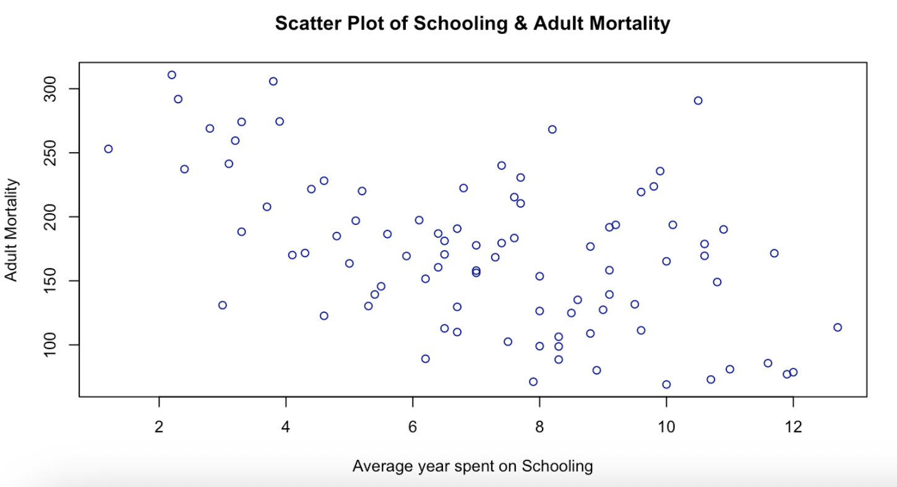
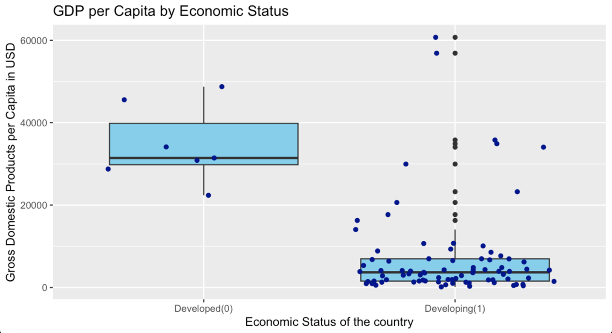
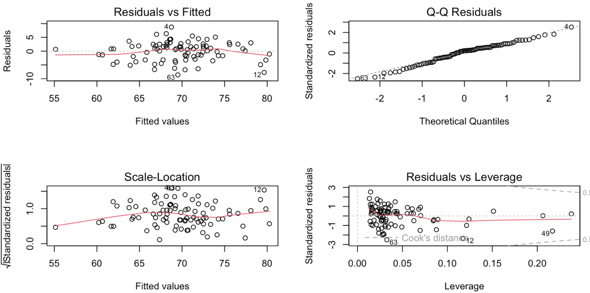

# Life Expectancy — Statistical & Regression Analysis in R

> **Status: Complete.** A data analysis coursework project.

## 1. Project overview

This project investigates how education and economic development relate to health outcomes across countries, using a WHO-derived dataset covering 88 countries in the year 2000 (22 variables spanning health, economic, and education indicators). Using R, I performed exploratory data analysis, hypothesis testing, and built a multiple linear regression model — refining it through several iterations and validating it with full diagnostic checks — then compared the findings against existing academic literature.

## 2. Data

The dataset (`data/life_expectancy_dataset.csv`) covers infant/adult mortality, immunisation coverage, GDP per capita, schooling, and economic development status, among others. Full column definitions are in `data/variable_description.txt`.

## 3. Exploratory Data Analysis (EDA)

- Descriptive statistics (mean, variance, skewness, kurtosis) calculated for every numerical variable
- Histograms, boxplots, and density plots examined for each variable's distribution
- Grouped comparisons across continent, region, and economic development status
- Confirmed no missing values in the dataset

Brainstorming ahead of EDA narrowed the search to a handful of candidate questions (e.g. *does GDP per capita influence life expectancy? does higher schooling reduce adult mortality?*), which were then refined into two formally testable hypotheses.

## 4. Hypothesis testing

**Hypothesis 1 — Is there a relationship between schooling and adult mortality?**

Assumption checks (linearity, normality via QQ-plot and Shapiro-Wilk test, no significant outliers via z-scores) were run before testing. The scatter plot below shows a moderate negative relationship — more years of schooling is associated with lower adult mortality.



**Result:** a statistically significant negative correlation (Pearson r ≈ -0.51, 95% CI [-0.65, -0.33], p = 4.55e-07) — rejecting H0. Higher average schooling is associated with lower adult mortality across countries.

**Hypothesis 2 — Is there a difference in GDP per capita between developed and developing countries?**



Normality was violated for the developing-country subgroup (Shapiro-Wilk p = 8.4e-14), so both a non-parametric Wilcoxon test and a parametric t-test were run to cross-check the result (variance equality confirmed first via F-test and Levene's test).

**Result:** both tests agreed (Wilcoxon p = 0.0001, t-test p = 2.2e-08) — developed countries have significantly higher GDP per capita than developing countries. The mean for developed economies was **USD 34,550**, nearly five times the developing-economy mean of **USD 7,350**, confirming a strong global economic divide.

## 5. Regression modelling

A multiple linear regression model was built using all 11 numeric health/economy/education predictors against life expectancy, then refined in two stages:

1. **Multicollinearity check** — a pairwise scatterplot matrix and correlation matrix identified two highly correlated predictor pairs (Polio & Diphtheria immunisation, r = 0.96; the two child-thinness variables, r = 0.92). Variance Inflation Factors (VIF) confirmed this, and one variable from each pair was dropped.
2. **Backward elimination** — iteratively removing the least significant remaining predictor (by p-value) across seven refinement attempts, tracking adjusted R² at each step.

**Final model:** all three remaining predictors were significant at p < 0.001:

```
Life_expectancy = 50.77 + 0.52 × Alcohol_consumption + 0.18 × Polio + 1.75×10⁻⁴ × GDP_per_capita
```

- Adjusted R² ≈ 0.631 (63.1% of variation in life expectancy explained)
- F-test p-value < 2.2e-16 (highly significant)

**Diagnostics on the final model:**



- **Residuals vs. Fitted** — no strong pattern, linearity assumption reasonably held
- **Q-Q Residuals** — closely follows the normal line, confirmed with Shapiro-Wilk test (p = 0.346)
- **Scale-Location** — roughly constant spread, confirmed with Breusch-Pagan test (p = 0.851, homoskedasticity holds)
- **Residuals vs. Leverage** — four points (rows 12, 48, 49, 63) exceed the Cook's distance threshold but don't meaningfully distort the model

As a final cross-check, the model was re-fitted using robust regression (`rlm()`) and heteroskedasticity-consistent standard errors (`lm_robust()`), both producing nearly identical coefficients and significance levels to the OLS model — confirming the model is robust to outlier influence and non-normal errors.

## 6. Conclusion

The analysis provides empirical evidence that **education and economic prosperity are fundamental factors in national health outcomes**:

- The schooling–mortality relationship aligns with existing research (Dawoud & Abu-Naser, 2023; Salomon et al., 2001; Lutz & Kebede, 2018), which links education attainment to better health literacy, preventive care access, and socioeconomic stability.
- The GDP gap between developed and developing economies mirrors global income inequality data (World Bank Group, 2022), reinforcing how economic disparity shapes healthcare funding, nutrition, and living conditions.

Investing in accessible education and sustainable economic growth remains a plausible lever for improving life expectancy and narrowing mortality gaps globally.

## Tech stack

- **R** — `dplyr`, `moments`, `DescTools`, `car` (VIF), `corrplot`, `MASS` (`rlm`), `estimatr` (`lm_robust`), `lmtest` (`bptest`)

## Project structure

```
life-expectancy-regression-analysis/
├── life_expectancy_analysis.R     # Full analysis script
├── data/
│   ├── life_expectancy_dataset.csv
│   └── variable_description.txt   # Column definitions
└── images/                         # Key charts referenced in this README
```

## Setup

```r
# Update the file path in the first line of the script to point to your local copy of data/life_expectancy_dataset.csv,
# then run in RStudio or from the command line:
Rscript life_expectancy_analysis.R
```

Required packages (installed at the top of the script): `moments`, `dplyr`, `DescTools`, `car`, `corrplot`, `lmtest`, plus `MASS` and `estimatr` for the robust regression models.

## Notes

This was an academic statistics coursework project — the script is written to run interactively in RStudio (plots are drawn to the graphics device rather than saved to file); the file path at the top will need updating to match wherever you place the dataset locally.

## Author

April Soe Naing — [aprilsoenaing.786@gmail.com](mailto:aprilsoenaing.786@gmail.com)
